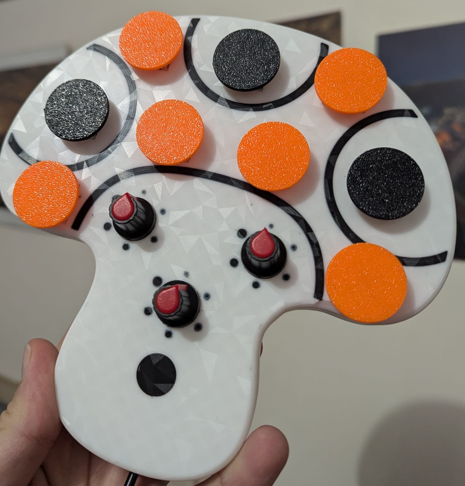
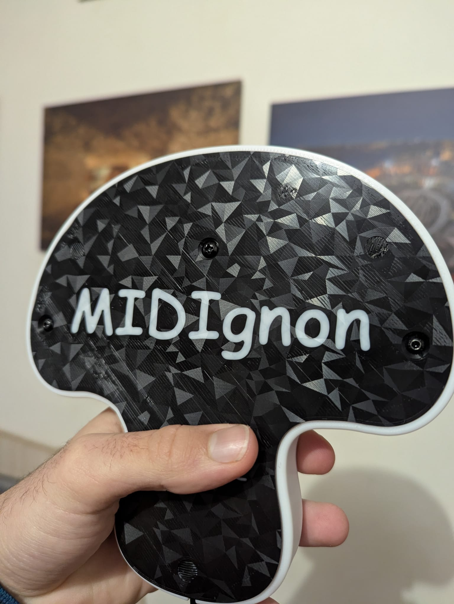
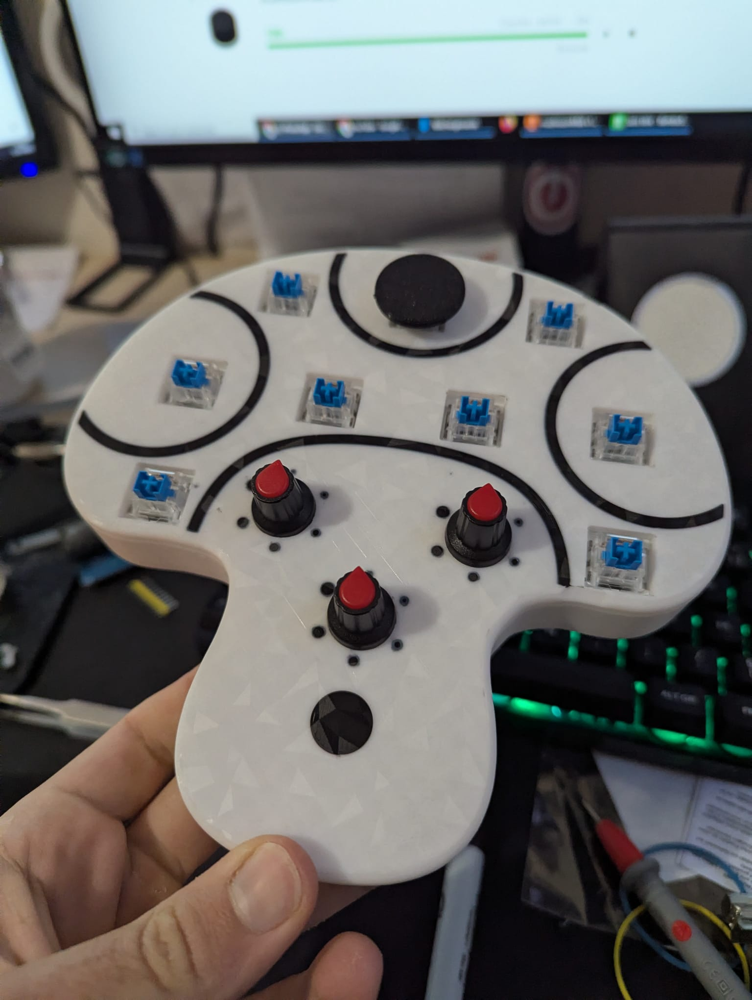
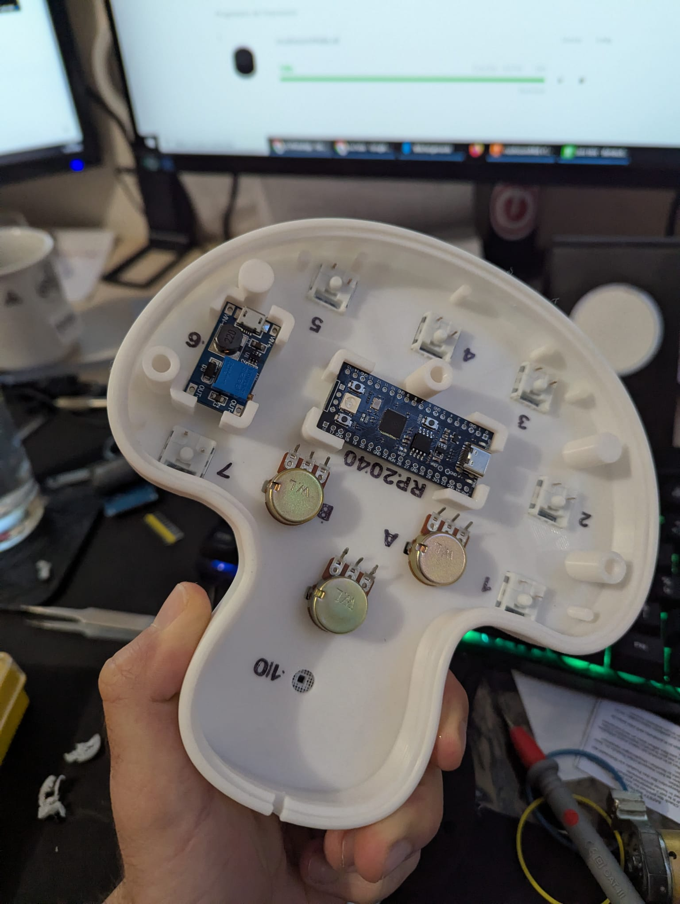
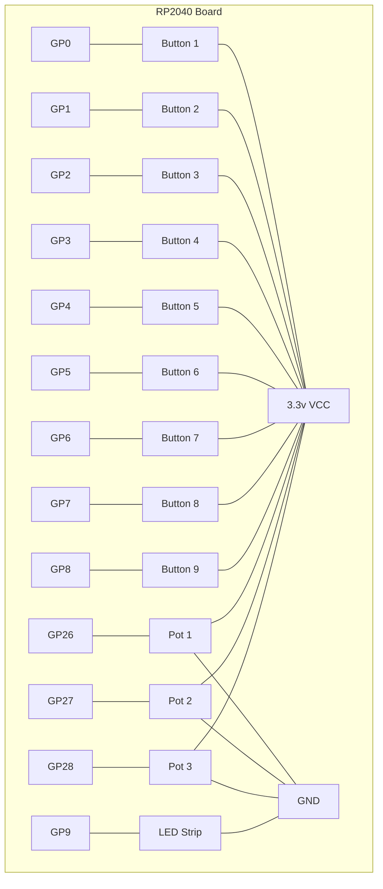

# MIDIgnon - A 3D-Printed Mushroom MIDI Controller

A stylish, general-purpose MIDI controller with a unique 3D-printed mushroom design, powered by an RP2040 microcontroller and CircuitPython.

## 🖼️ Gallery

| Back | Electronics Outside | Electronics Inside |
|---|---|---|
|  |  |  |

## 🍄 Features

*   **9 Buttons:** Mapped to a C-major scale for intuitive musical expression.
*   **3 Analog Potentiometers:** For real-time control over effects and parameters (CC messages).
*   **Visual Feedback:** Features a "breathing" LED animation and a "blink" effect on button presses.
*   **Customizable:** Easily modify the code to change MIDI mappings, LED colors, and more.
*   **Unique Design:** Housed in a charming 3D-printed mushroom enclosure.

## 🛠️ Hardware

### Components

*   **Microcontroller:** Raspberry Pi Pico or any other RP2040-based board.
*   **Buttons:** 9 x push buttons.
*   **Potentiometers:** 3 x 10k Ohm linear potentiometers.
*   **LEDs:** 
    *   Onboard LED of the RP2040 board.
    *   (Optional) 12V LED strip for extra visual flair.
*   **3D-Printed Parts:**
    *   Mushroom Cap & Body
    *   Keys/Buttons

### Wiring

Here is a diagram illustrating the connections between the RP2040 and the components.

*Each button is connected to its corresponding GPIO pin and to VCC (3.3v). The internal pull-down resistors are used.*
*Each potentiometer's signal pin is connected to its corresponding ADC pin. The other two pins are connected to VCC (3.3V) and Ground (GND).*

## 🚀 Software & Setup

This project uses CircuitPython, which makes it incredibly easy to get started.

### 1. Install CircuitPython

1.  Download the latest `.uf2` file for your RP2040 board from the [CircuitPython website](https.docs.circuitpython.org/en/latest/board_specific_info.html).
2.  Put your board into **bootloader mode** by holding the `BOOTSEL` button while plugging it into your computer.
3.  It will appear as a USB drive named `RPI-RP2`.
4.  Drag and drop the downloaded `.uf2` file onto this drive.
5.  The board will reboot and reappear as a drive called `CIRCUITPY`.

### 2. Add Libraries

1.  Download the latest library bundle from the [Adafruit CircuitPython Bundle website](https://circuitpython.org/libraries).
2.  From the bundle, find the `lib` folder and copy the following items into the `lib` folder on your `CIRCUITPY` drive:
    *   `adafruit_midi` (folder)
    *   `neopixel.mpy` (if you plan to use NeoPixel LEDs)

### 3. Copy Project Files

Simply drag and drop the `code.py` file from this repository onto your `CIRCUITPY` drive.

## 🎹 Usage

Once everything is set up, plug the controller into your computer via USB. It will be automatically recognized as a MIDI device. Open your favorite Digital Audio Workstation (DAW) or music software, and you should be able to map the buttons and knobs to any function you like!

## 🤝 Contributing

Contributions, issues, and feature requests are welcome! Feel free to check the [issues page](https://github.com/kaa-serpent/MIDIgnon/issues).

## 📄 License

This project is licensed under the MIT License - see the [LICENSE.md](LICENSE.md) file for details.
